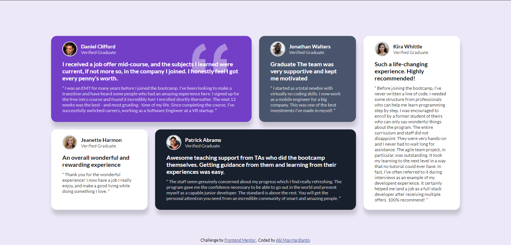
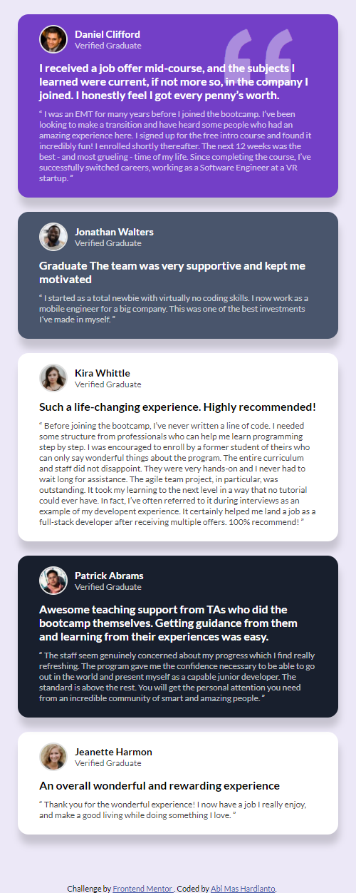

# Testimonial Grid Section

Project ini berdasarkan pada challenge di Frontend Mentor [Testimonials grid section challenge on Frontend Mentor](https://www.frontendmentor.io/challenges/testimonials-grid-section-Nnw6J7Un7).

## Daftar Isi

- [Overview](#overview)
  - [Penjelasan Project](#the-challenge)
  - [Screenshot](#screenshot)
  - [Links](#links)
- [Proses](#proses)
  - [Stack yang digunakan](#stack-yang-digunakan)
  - [Hal yang dipelajari](#hal-yang-dipelajari)
  - [Resources](#resources)
- [Author](#author)

## Overview

### Penjelasan Project

Pada project ini saya membangun sebuah section dengan menggunakan CSS Grid untuk mengatur layout. Untuk desain sudah diberikan oleh frontend mentor, saya hanya membuat semirip mungkin.
Fokus utama pada project ini adalah HTML dan CSS Grid.
Objektif pada project ini:

- Membuat layout dengan CSS Grid
- Menampilkan layout yang sesuai dengan ukuran layar(responsive)

### Screenshot

**Tampilan Desktop**

**Tampilan Mobile** 

### Links

- Solution URL: [Solution Code](https://github.com/abimh66/testimonial-grid-section-frontendmentor)
- Live Site URL: [live site]()

## Proses

### Stack yang digunakan

- Semantic HTML5 markup
- CSS Grid
- Flexbox
- Desktop-first workflow

### Hal yang dipelajari

Banyak hal yang dipelajari dari project ini terutama adalah CSS Grid. Gabungan CSS Grid dan CSS Flexbox sangat powerful untuk melakukan layouting element. CSS Grid juga memudahkan membuat tampilan responsive. Pada project ini saya juga belajar alur pengerjaan desktop-first

### Resources

- [Mozilla MDN JavaScript Documentation](https://developer.mozilla.org/en-US/docs/Web/JavaScript)

## Author

- Website - [abiproject.com](https://www.abiproject.com)
- Frontend Mentor - [@abimh66](https://www.frontendmentor.io/profile/abimh66)
- Codewars - [@abimh66](https://www.codewars.com/users/abimh66)
- Twitter - [@abimhrdnt](https://www.twitter.com/abimhrdnt)
